# Dataset Scraper

https://www.inaturalist.org/pages/developers

## JSON File

Family -> Species

### Mermaid Diagram

```mermaid
graph TD
    ROOT["Tropical Fish Dataset<br>9 families · 12 species"]

    ROOT --> ACN["Acanthuridae<br>Surgeonfishes, Tangs & Unicornfishes"]
    ROOT --> LAB["Labridae<br>Wrasses and Parrotfishes"]
    ROOT --> POM["Pomacentridae<br>Damselfishes"]
    ROOT --> CHA["Chaetodontidae<br>Butterflyfishes"]
    ROOT --> POC["Pomacanthidae<br>Angelfishes"]
    ROOT --> BAL["Balistidae<br>Triggerfishes"]
    ROOT --> SCO["Scorpaenidae<br>Scorpionfishes and Lionfishes"]
    ROOT --> TET["Tetraodontidae<br>Pufferfishes"]
    ROOT --> CAR["Carcharhinidae<br>Requiem Sharks"]

    ACN --> ACN1["Atlantic Blue Tang<br>Acanthurus coeruleus"]
    ACN --> ACN2["Bluespine Unicornfish<br>Naso unicornis"]

    LAB --> LAB1["Blue-barred Parrotfish<br>Scarus ghobban"]
    LAB --> LAB2["Moon Wrasse<br>Thalassoma lunare"]

    POM --> POM1["Ocellaris Anemonefish<br>Amphiprion ocellaris"]
    POM --> POM2["Blacktail Humbug<br>Dascyllus melanurus"]

    CHA --> CHA1["Raccoon Butterflyfish<br>Chaetodon lunula"]

    POC --> POC1["Emperor Angelfish<br>Pomacanthus imperator"]

    BAL --> BAL1["Lagoon Triggerfish<br>Rhinecanthus aculeatus"]

    SCO --> SCO1["Red Lionfish<br>Pterois volitans"]

    TET --> TET1["Guineafowl Puffer<br>Arothron meleagris"]

    CAR --> CAR1["Blacktip Reef Shark<br>Carcharhinus melanopterus"]

    style ROOT fill:#0d3b4f,stroke:#00c9a7,color:#e8edf2
    style ACN fill:#1a2a3b,stroke:#38bdf8,color:#e8edf2
    style LAB fill:#2d1b4e,stroke:#a78bfa,color:#e8edf2
    style POM fill:#1a3a2a,stroke:#34d399,color:#e8edf2
    style CHA fill:#3b2a0f,stroke:#fbbf24,color:#e8edf2
    style POC fill:#3b0f1a,stroke:#f87171,color:#e8edf2
    style BAL fill:#0f2b3b,stroke:#38bdf8,color:#e8edf2
    style SCO fill:#2a1f0f,stroke:#fb923c,color:#e8edf2
    style TET fill:#1a2a3b,stroke:#60a5fa,color:#e8edf2
    style CAR fill:#2a0f2a,stroke:#e879f9,color:#e8edf2

    style ACN1 fill:#0d1e2b,stroke:#2a3f52,color:#94a3b8
    style ACN2 fill:#0d1e2b,stroke:#2a3f52,color:#94a3b8
    style LAB1 fill:#0d1e2b,stroke:#2a3f52,color:#94a3b8
    style LAB2 fill:#0d1e2b,stroke:#2a3f52,color:#94a3b8
    style POM1 fill:#0d1e2b,stroke:#2a3f52,color:#94a3b8
    style POM2 fill:#0d1e2b,stroke:#2a3f52,color:#94a3b8
    style CHA1 fill:#0d1e2b,stroke:#2a3f52,color:#94a3b8
    style POC1 fill:#0d1e2b,stroke:#2a3f52,color:#94a3b8
    style BAL1 fill:#0d1e2b,stroke:#2a3f52,color:#94a3b8
    style SCO1 fill:#0d1e2b,stroke:#2a3f52,color:#94a3b8
    style TET1 fill:#0d1e2b,stroke:#2a3f52,color:#94a3b8
    style CAR1 fill:#0d1e2b,stroke:#2a3f52,color:#94a3b8
```

## Example URLs

See observations for a specific species (taxon id): https://www.inaturalist.org/observations?photo_license=cc0&taxon_id=121196

API endpoint for observation photos: https://api.inaturalist.org/v1/observations

API endpoint for taxon information: https://api.inaturalist.org/v1/taxa?id=179880
